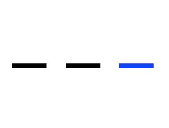

[](https://www.npmjs.com/package/@y7k/component-navigation-bar) [](https://www.npmjs.com/package/@y7k/component-navigation-bar)

# Y7K Component: Navigation Bar

The Navigation Bar is a group of links or labels that belong to each other and only one of them can be selected. If you select a link, it will emit a event to its parent Vue component.

It is based on [Vue 2](https://vuejs.org), [MaintainableCSS](https://maintainablecss.com/) and the [Y7K Style Plate](https://github.com/y7k/style). Detailed information in the [Y7K Showroom](https://showroom.y7k.tools/showroom/pages/components/lists/filterable-list/index-filterable-list).





## Installation

##### Install npm package
```bash
npm install @y7k/component-navigation-bar --save
```

##### Include in your project
```js
import navigationBar from '@y7k/component-navigation-bar';
```

##### Variant 1: Register components globally:
```js
import navigationBar from '@y7k/component-navigation-bar';
navigationBar.registerGlobally();
```
 
##### Variant 2: Use components directly:
```js
import { NavigationBar } from '@y7k/component-navigation-bar';

// Vue component example
export default {

    components: {
        NavigationBar,
    },
}
```

##### Include styles
In your main.scss file
```scss
@import '@y7k/filterable-list/src/scss/navigationBar';

// If you don't set "node_modules" as a webpack include path:
@import '../[path]/../node_modules/@y7k/component-navigation-bar/src/scss/navigationBar';
```


## Documentation
Please have a look at the usage documentation in the [Y7K Showroom](https://showroom.y7k.tools/showroom/pages/components/ui-elements/navigation-bar/index-navigation-bar).
